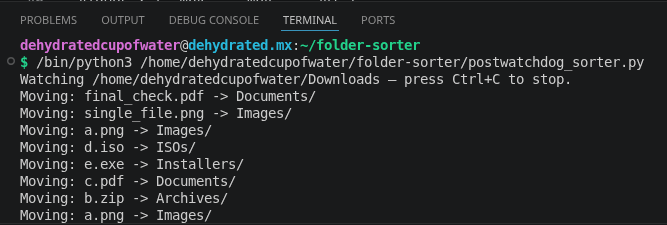

# Folder Sorter

A cross-platform Python script that watches a folder (e.g. your
Downloads folder) and automatically sorts new files into subfolders
based on their extension — `.png` → `Images/`, `.zip` → `Archives/`,
`.iso` → `ISOs/`, and so on. Works on Linux, macOS, and Windows universally!

## How It Works

The script uses [`watchdog`](https://pypi.org/project/watchdog/) to
listen for filesystem events. The moment a new file appears (or a
partial download finishes and gets renamed), the script checks its
extension against `config.json` and moves it into the matching
subfolder. Files with no matching category are left untouched.
Filename collisions are handled automatically (`photo.png` becomes
`photo_1.png`, `photo_2.png`, etc. if a name's already taken)
Existing files are never overwritten. (Let me know if you encounter bugs!)



## Requirements
- Python 3.9 or newer
- Install dependencies:
  \```
  pip install -r requirements.txt
  \```

  ## How to Run
\```
python3 postwatchdog_sorter.py --folder ~/Downloads
\```
(Defaults to `~/Downloads` if `--folder` isn't specified.)

## Customizing Categories
Extension categories are defined in `config.json`, a plain text file
you can edit without any programming knowledge. Open it in any text
editor and follow the existing pattern:

\```json
"CategoryName": [".ext1", ".ext2"]
\```

For example, to add a "Videos" category:

\```json
"Videos": [".mp4", ".mov", ".avi"]
\```

Add it as a new line inside the outer `{ }` braces, make sure there's
a comma after the previous entry, and save the file. No restart code
changes needed just restart the script.